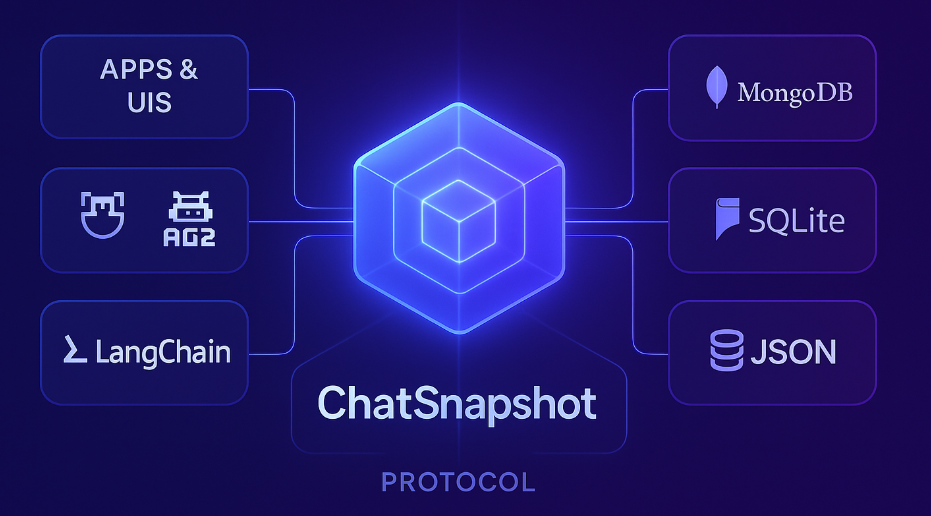

# ChatSnapshot

**A durable execution ledger for agentic and distributed systems.**

As agentic systems evolve into distributed, multi-agent applications, there is no canonical layer that defines what actually happened across workflows, services, and runtimes. Existing infrastructure — A2A for messaging, OpenTelemetry for tracing, and agent runtimes like AG2 for cognitive execution — provides communication and observability, but not authoritative, replayable system state. In distributed environments where multiple groupchats, agents, tools, and external services operate asynchronously, signals are emitted across boundaries without a unified mechanism to correlate, commit, and persist application-level state transitions. The result is fragmented execution history, ambiguous causality, and no durable definition of system truth.

ChatSnapshot fills that gap by providing a durable execution history that higher-level systems can build upon.

For the canonical architecture write-up, see [infrastructure.md](infrastructure.md).

---

## 🧠 The Core Idea

Modern agent systems are cognitively stateful but systemically ephemeral.

Conversations feel continuous, but execution history often lives only inside a runtime.

ChatSnapshot establishes a stable execution record that survives:

- Agent restarts
- Workflow branching
- Distributed execution
- UI interactions
- Tool invocations
- Cross-service orchestration

It becomes the execution ledger for your system.

---

## 🧾 The Event Envelope

All activity is normalized into a canonical `EventEnvelope`.

```json
{
  "event_id": "uuid",
  "event_type": "execution.message | execution.tool_call | system.workflow_started",
  "timestamp": "ISO8601",
  "source": {
    "origin": "agent | system | ui | integration",
    "runtime": "ag2 | custom | none"
  },
  "correlation_id": "run_id | workflow_id | session_id",
  "causation_id": "parent_event_id | null",
  "payload": {}
}
```

This structure guarantees:

- Immutability
- Causal linkage
- Ordered replay
- Cross-boundary traceability

Framework-specific details remain inside `payload`. The envelope stays stable.

---

## 🧠 What It Records

ChatSnapshot ingests normalized execution facts from:

**Agent runtimes**

- Messages emitted
- Tool calls requested
- Tool results returned
- Human input requested
- Run transitions
- State changes

**Application systems**

- Workflow lifecycle events
- Task scheduling
- API triggers
- Integration calls
- UI interactions

Everything becomes part of a single, append-only history.

---

## 🧮 What This Enables

Once execution truth is durable, higher abstractions become possible.

- **Deterministic replay**: Reconstruct the timeline of a run or workflow without re-executing it.
- **DAG & workflow reconstruction**: Derive task graphs and execution order from recorded events.
- **Agent context injection**: Supply real execution history back into prompts for contextual awareness beyond a single conversation.
- **Cross-runtime continuity**: Span multiple agent frameworks or services while preserving one unified history.
- **Audit & compliance**: Maintain an immutable ledger of decisions, tool usage, and system transitions.
- **Learning systems**: Feed execution history into semantic reasoning or optimization layers.

ChatSnapshot provides the raw truth layer. Other systems build intelligence on top of it.

---

## 🧱 Where It Fits in the Stack



---

## 🔌 How It Integrates

ChatSnapshot does not dictate execution logic. It preserves execution history.

Example (agent runtime):

```python
for event in agent.run_iter(...):
    snapshot.record(
        event_type=map_event(event),
        correlation_id=run_id,
        payload=normalize(event)
    )
```

Example (application system):

```python
snapshot.record(
    event_type="system.workflow_started",
    correlation_id=workflow_id,
    payload=data
)
```

---

## 🏗 Architecture (Conceptual)

```
Agent Runtime / Application Layer
                ↓
        Ingest Adapter
                ↓
     Canonical EventEnvelope
                ↓
       Append-Only Store
                ↓
      Projection Systems
```

Adapters normalize runtime-specific events into stable primitives.
Projections derive structured views (transcripts, workflows, timelines, metrics).

---

## ⚙️ Installation

```bash
# Clone the repository
git clone https://github.com/BlocUnited-LLC/ChatSnapshot.git
cd ChatSnapshot

# Install dependencies
pip install -r requirements.txt

# Install in development mode
pip install -e .
```

### Dependencies

- Python 3.8+
- AG2 (AutoGen) via `ag2[openai]` (see `requirements.txt`)
- Storage backends:
  - JSON / SQLite / Memory: standard library
  - MongoDB: optional/experimental (async adapter)

---

## 🚀 Quick Start (Current Code)

The current implementation persists and restores AG2 chat state via `AG2ChatPersistence`.

```python
from chatsnapshot import AG2ChatPersistence, StorageBackend

persistence = AG2ChatPersistence(storage_backend=StorageBackend.JSON)

snapshot = persistence.save_conversation(
    chat_id="my_chat_001",
    agents=[agent1, agent2],
    messages=chat_history,
    metadata={"use_case": "team_collab"},
)

loaded = persistence.load_conversation("my_chat_001")
if loaded:
    persistence.restore_conversation(loaded, [agent1, agent2])
```

---

## 📚 Explore the Project

- `/src/chatsnapshot` – Package source
- `/src/chatsnapshot/storage` – Storage adapters
- `/src/chatsnapshot/tests` – Tests
- `/examples` – Usage examples (see `examples/minimal.py`)
- [infrastructure.md](infrastructure.md) – Architecture and event model

---

## 🧱 Repo Structure

```
src/chatsnapshot/
├── __init__.py
├── snapshot.py
├── manager.py
├── persistent_mixin.py
├── storage/
│   ├── __init__.py
│   ├── base.py
│   ├── json_adapter.py
│   ├── sqlite_adapter.py
│   ├── memory_adapter.py
│   └── mongodb_adapter.py
└── tests/
```

---

## 💾 Storage Backends (Current Code)

- **JSON**: human-readable file storage
- **SQLite**: structured local database
- **Memory**: fast in-memory storage for testing

The repo also contains an experimental async MongoDB adapter.

---

## 🌐 Ecosystem Usage

ChatSnapshot can serve as the foundation for:

- Agent operating systems
- Workflow kernels
- Agent development platforms
- Compliance & audit pipelines
- Multi-runtime orchestration layers
- Cross-application state continuity

It establishes durable execution truth. Intelligence layers build on top of it.

---

## 💡 Roadmap

- Core append-only store
- Event validation & schema tooling
- Framework adapters
- Replay APIs
- Projection engine
- Streaming ingestion

---

## 📄 License

This project is licensed under the MIT License - see the `LICENSE` file for details.
